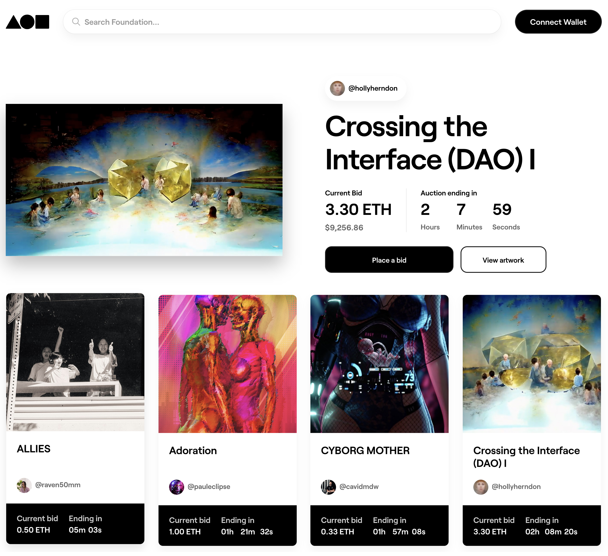

A subgraph built to query data from [Foundation](https://foundation.app/) using the Foundation Smart Contract.



To deploy this subgraph, follow these steps.

1. Clone the project:

```sh
git clone https://github.com/dabit3/foundation-subgraph.git
```

2. 